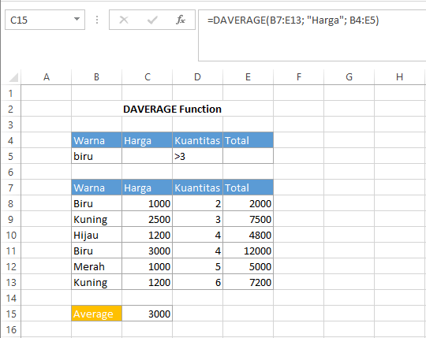

# DAVERAGE Function

`DAVERAGE` Function digunakan untuk menghitung rata-rata nilai dalam kolom database sesuai dengan kondisi yang ditentukan. Sintaks fungsi `DAVERAGE` ialah sebagai berikut :

```text
DAVERAGE(database, field, criteria)
```

| Argumen | Fungsi |
| :--- | :--- |
| Database | rentang data atau database termasuk header. |
| Field | kolom yang akan digunakan dalam fungsi. |
| Criteria | rentang sel termasuk header yang berisi syarat. |

#### Contoh :



