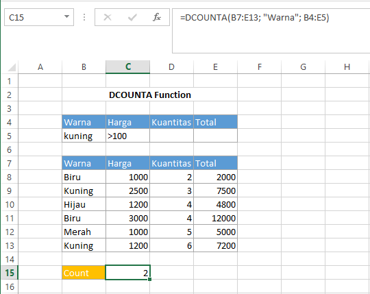

# DCOUNTA Function

Fungsi `DCOUNTA` tidak jauh berbeda dengan fungsi `DCOUNT`. Fungsi `DCOUNTA` akan menghitung sel yang tidak kosong. Pada fungsi `DCOUNTA` ini, argumen field bersifat optional. Syntax untuk fungsi `DCOUNTA` :

```text
DCOUNTA(database, field, criteria)
```


Untuk keterangan setiap argumen sama dengan keterangan pada fungsi `DAVERAGE`


#### Contoh :



