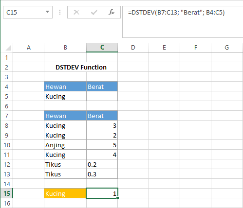

# DSTDEV Function

Fungsi `DSTDEV` digunakan untuk memperkirakan standar deviasi \(simpangan baku\) populasi berdasarkan sampel angka pada field yang sesuai dengan syarat. Syntax fungsi `DSTDEV` :

```text
DSTDEV(database, field, criteria)
```


Untuk keterangan setiap argumen sama dengan keterangan pada fungsi `DAVERAGE`


#### Contoh :



