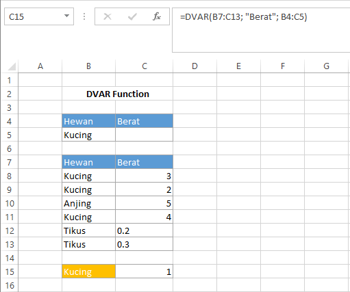

# DVAR Function

Fungsi `DVAR` digunakan untuk memperkirakan varians dari populasi berdasarkan sampel pada field database. Syntax fungsi `DVAR` :

```text
DVAR(database, field, criteria)
```


Untuk keterangan setiap argumen sama dengan keterangan pada fungsi `DAVERAGE`.


#### Contoh :



