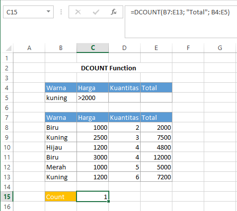

# DCOUNT Function

`DCOUNT` Function digunakan untuk menghitung sel-sel yang berisi angka dalam kolom database yang sesuai dengan kondisi yang ditentukan. Jika kolom tidak ada kondisi untuk kolom database \(atau field bidang yang ditentukan\), maka `DCOUNT` akan menghitung seluruh data angka. Syntax `DCOUNT` :

```text
DCOUNT(database, field, criteria)
```


Untuk keterangan setiap argumen sama dengan keterangan pada fungsi `DAVERAGE`


## Contoh :



