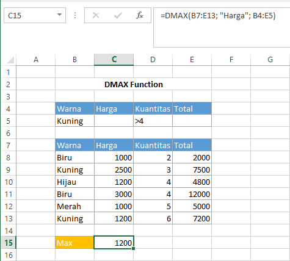

# DMAX Function

Fungsi `DMAX` digunakan ketika kita ingin mengetahui nilai terbesar dari data yang ingin kita cari dengan syarat yang spesifik. Syntax untuk fungsi `DMAX` :

```text
DMAX(database, field, criteria)
```


Untuk keterangan setiap argumen sama dengan keterangan pada fungsi `DAVERAGE`


## Contoh :



