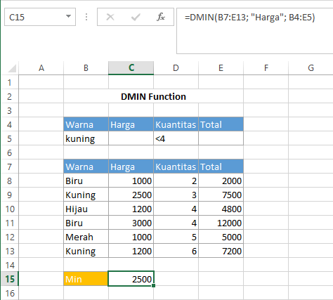

# DMIN Function

Fungsi `DMIN` merupakan kebalikan dari fungsi `DMAX`. Fungsi ini digunakan ketika kita ingin mencari nilai minimum dari suatu data dengan syarat yang spesifik. Syntax untuk fungsi `DMIN` :

```text
DMIN(database, field, criteria)
```


Untuk keterangan setiap argumen sama dengan keterangan pada fungsi DAVERAGE


## Contoh :



