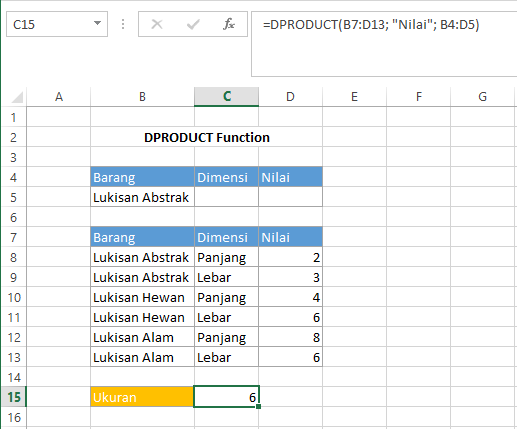

# DPRODUCT Function

Fungsi ini akan mengalikan nilai pada kolom field yang sesuai dengan syarat yang ditentukan. Syntax untuk fungsi `DPRODUCT` :

```text
DPRODUCT(database, field, criteria)
```


Untuk keterangan setiap argumen sama dengan keterangan pada fungsi `DAVERAGE`


## Contoh :



