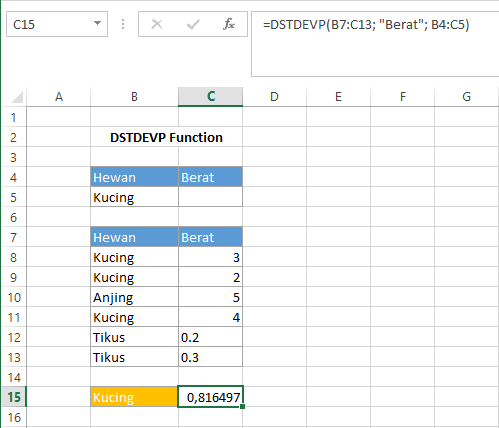

# DSTDEVP Function

Fungsi `DSTDEVP` sama dengan fungsi `DSTDEV`. Namun, fungsi `DSTDEVP` digunakan untuk memperkirakan standar deviasi \(simpangan baku\) dari populasi angka pada field berdasarkan seluruh populasi yang sesuai dengan kriteria. Syntax fungsi `DSTDEVP` :

```text
DSTDEVP(database, field, criteria)
```


Untuk keterangan setiap argumen sama dengan keterangan pada fungsi `DAVERAGE`


## Contoh :



