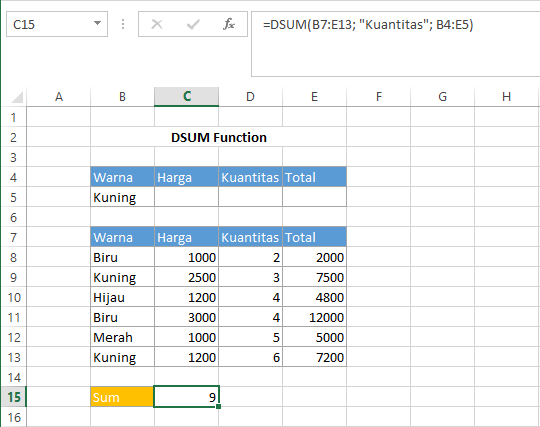

# DSUM Function

Fungsi `DSUM` sama dengan fungsi `SUM`, digunakan untuk menjumlahkan angka. Namun, `DSUM` digunakan untuk di dalam field database yang sesuai dengan syarat. Syntax fungsi `DSUM` :

```text
DSUM(database, field, criteria)
```


Untuk keterangan setiap argumen sama dengan keterangan pada fungsi `DAVERAGE`


## Contoh :



