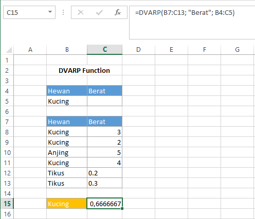

# DVARP Function

Fungsi `DVARP` digunakan untuk memperkirakan varians dari populasi berdasarkan seluruh populasi pada field database yang sesuai dengan syarat. Syntax `DVARP` :

```text
DVARP(database, field, criteria)
```


Untuk keterangan setiap argumen sama dengan keterangan pada fungsi `DAVERAGE`


## Contoh :



