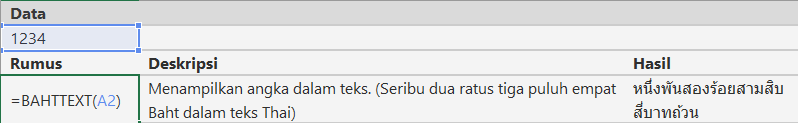

# BAHTTEXT Function

BAHTTEXT berfungsi untuk mengonversi angka menjadi teks bahasa Thailand, dengan format mata uang ß \(baht\)

## Sintaks

```text
BAHTTEXT(number)
```

| Argumen | Fungsi |
| :--- | :--- |
| number | Angka yang ingin Anda konversi menjadi teks, atau referensi ke sel berisi angka atau rumus yang mengevaluasi ke sebuah angka. |

## Contoh



