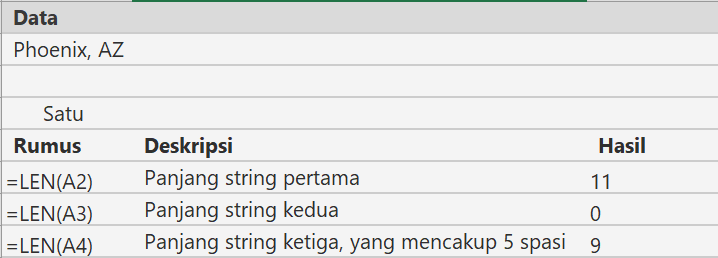

# LEN, LENB Function

LEN berfungsi untuk mengembalikan jumlah karakter dalam string teks.

LENB berfungsi untuk mengembalikan jumlah byte yang digunakan untuk menunjukkan karakter dalam string teks.


LENB hanya menghitung 2 byte per karakter ketika sebuah bahasa DBCS diatur sebagai bahasa default. Jika tidak, maka LENB berlaku sama seperti LEN, menghitung 1 byte per karakter.


## Sintaks

```text
LEN(teks)
```

```text
LENB(teks)
```

| Argumen | Fungsi |
| :--- | :--- |
| text | Teks yang panjangnya ingin Anda cari. |

## Contoh

### LEN



### LENB


